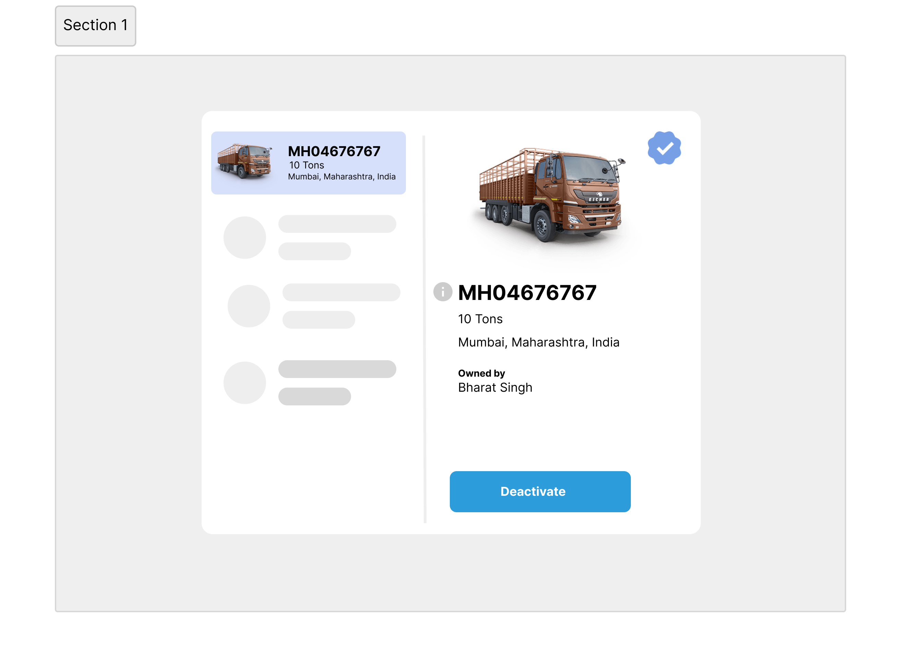
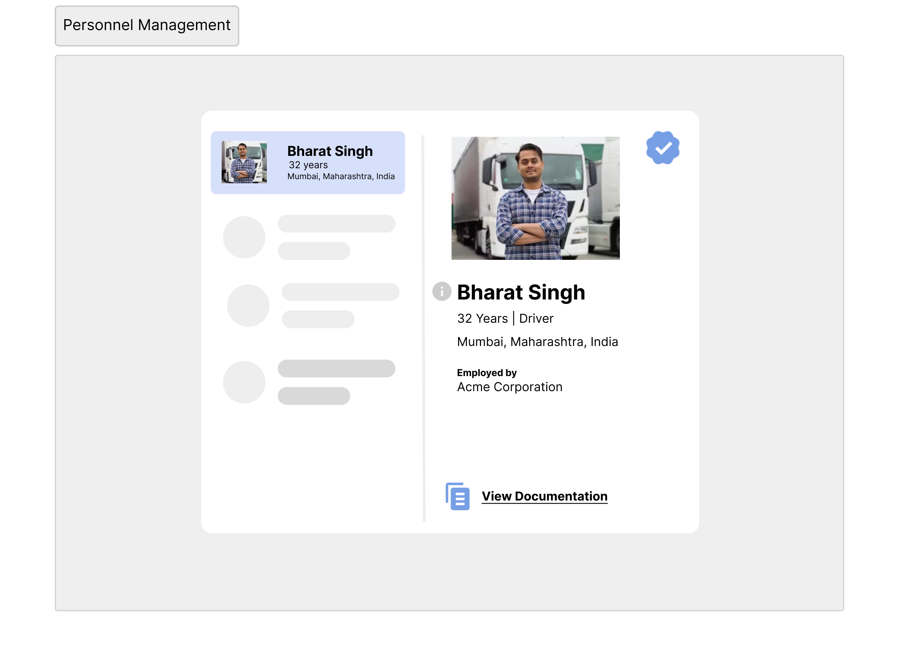
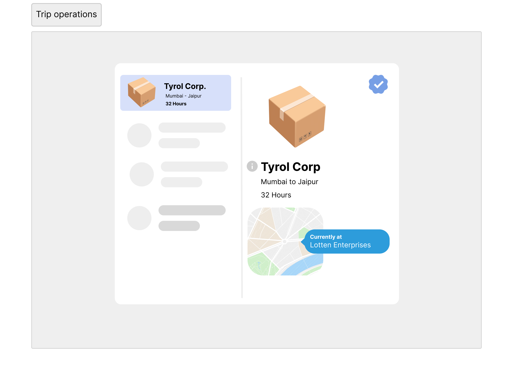

# Trips Evaluation

## Summary

This project emphasizes on enabling data gathered during logistical operations across PAN India. We 
assume that there is a fictional corporation called "Acme Corporation" which is responsible for FMCG (Fast Moving Consumer Goods) operations and have the utilities to track numerous parameters related to on-field operations.

This project aims to collaboratively build number of solutions that helps people who are engaged in the operations
of this logistics firm.

## Parts of operations

### Fleet Management

The company has a couple of hundred of vehicles of many sizes to deal with different types of loads. These vehicles
may be owned by the company itself or is leased from the trusted partners during the times of operations. Fleet Management is responsible for the following things.

- keeping a database for the vehicles which are used during the operations.
- storing official documentation of the vehicle including licenses and insurances.
- keeping a track of vehicle's milestone data and activities.

### Personnel Management

As the company is engaged in PAN India operations, it is obvious that it would be having a great number of human resources at every level. It is also important to measure different factors related to operation personnel, since they are the one's who are driving the company operationally. This in return should push the company to pursue
- maintaining records of the employees (personal and employment details)
- attendance records (driving hours, break times, leaves etc)
- key performance indicators

### Trip operations

The gist of the experiment revolves around how the company performs the operation and what best could we derive from it. It is thus essential to maintain the following aspects of the operations
- list of locations (hubs and merchant locations)
- trips details activity
- trips GPS data
- cost tracker
- safety compliances
- damages and losses occured during the trip